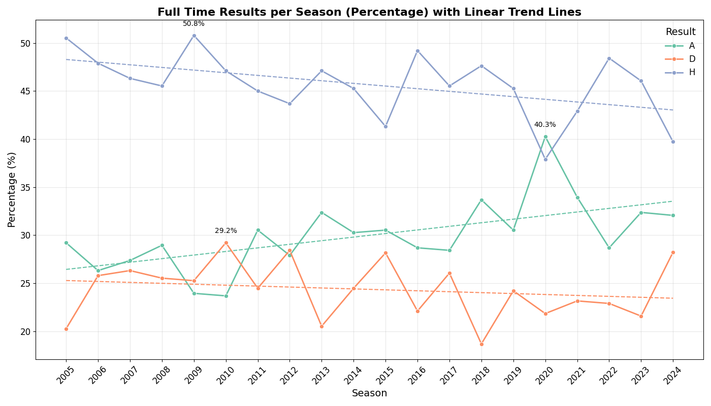

# Midterm Project: Premier League Football Prediction

## Overview

This project aims to predict the outcomes of Premier League football matches using machine learning models. It explores various features to determine their importance in predicting match results—whether it’s a home win, draw, or away win.

## Table of Contents

- [Midterm Project: Premier League Football Prediction](#midterm-project-premier-league-football-prediction)
  - [Overview](#overview)
  - [Table of Contents](#table-of-contents)
  - [Problem Description](#problem-description)
  - [Data](#data)
    - [Home Wins (H)](#home-wins-h)
    - [Away Wins (A)](#away-wins-a)
    - [Draws (D)](#draws-d)
  - [Key Observations](#key-observations)
  - [Scripts](#scripts)
    - [01\_data\_gathering](#01_data_gathering)
    - [02\_data\_preparation](#02_data_preparation)
    - [03\_eda](#03_eda)
    - [04\_train\_model](#04_train_model)
    - [05\_back\_testing](#05_back_testing)
  - [Getting Started](#getting-started)
    - [Prerequisites](#prerequisites)
    - [Clone the Repository](#clone-the-repository)
    - [Installing Dependencies](#installing-dependencies)
      - [Navigate to Your Project Directory](#navigate-to-your-project-directory)
      - [Install the Project Dependencies](#install-the-project-dependencies)
      - [Activate the Virtual Environment](#activate-the-virtual-environment)
    - [Running Docker](#running-docker)
    - [Running on AWS Elastic Beanstalk](#running-on-aws-elastic-beanstalk)
      - [Troubleshooting](#troubleshooting)
    - [Testing the Model](#testing-the-model)
    - [Running the Streamlit App (Bonus)](#running-the-streamlit-app-bonus)
  - [Contributing](#contributing)

## Problem Description

Predicting football match outcomes is a challenging yet captivating task that has long intrigued sports analysts and enthusiasts. This project focuses on the Premier League, aiming to forecast match results—home win, draw, or away win—by leveraging historical match data and team statistics.

In the [mlzoomcamp2024-midterm-project](https://github.com/RuiFSP/mlzoomcamp2024-midterm-project/tree/main), traditional machine learning algorithms like XGBoost were employed to build robust models, achieving strong performance and identifying key features that influence match outcomes. Building upon that foundation, the final project shifts toward exploring deep learning approaches, which can capture more complex patterns and interactions within the data.

By employing advanced deep learning architectures (e.g., neural networks, LSTMs, or CNNs), the project aims to:

Improve prediction accuracy.
Explore how deep learning can handle the inherent unpredictability and dynamic nature of football matches.
Gain insights into latent patterns that traditional methods may overlook.
Despite the ever-changing dynamics of sports and the competitive nature of prediction markets, this project aspires to push the boundaries of sports analytics by integrating cutting-edge techniques. The ultimate goal is not only to enhance predictive performance but also to provide valuable insights into the factors driving match outcomes.

## Data

The raw data for this project is sourced from [Football Data](https://www.football-data.co.uk/data.php). The focus is exclusively on the Premier League, covering seasons from 2005/2006 to 2024/2025. The raw data files can be found [here](https://github.com/RuiFSP/mlzoomcamp2024-midterm-project/tree/main/data/raw_data).




### Home Wins (H)
- **Dominant Trend**: Home wins consistently have the highest percentage among the three outcomes.
- **Long-Term Decline**: There is a slight decline in home win percentages from 2005 to around 2019.
- **Impact of 2020**: A significant drop occurs in 2020, likely due to external factors (e.g., the COVID-19 pandemic reducing home advantage).
- **Recovery**: Home win percentages show a recovery trend after 2020.

### Away Wins (A)
- **Stable Range**: Away wins generally hover in the 20–30% range, with minor fluctuations.
- **Recent Increase**: There is a slight increase in away wins in recent years, peaking around 2021 before stabilizing.

### Draws (D)
- **Lowest Percentage**: Draw percentages remain the lowest of the three outcomes, staying between 20–30%.
- **No Long-Term Trend**: There is no significant upward or downward trend, although short-term spikes and dips are visible.

## Key Observations
1. **2020 as a Pivotal Season**:
   - Home wins dropped significantly.
   - Away wins and draws increased noticeably during this season, potentially due to the neutralization of home advantage (e.g., matches without crowds).

2. **Home Advantage**: Home wins remain the dominant result over the years, indicating the significant influence of playing at home in football/soccer.

3. **Shift Toward Away Wins**: In the later years of the dataset, away wins have gained slight prominence.

---


## Scripts

### 01_data_gathering

The `01_data_gathering.py` script performs the following key steps:

1. **Ensure Directories Exist**: Checks and creates necessary directories for storing data.
2. **Download Data**: Downloads CSV files for the specified seasons.
3. **Check Columns**: Verifies that the columns in the downloaded files match the expected schema.
4. **Concatenate Data**: Combines data from multiple seasons into a single dataset.
5. **Save Processed Data**: Saves the concatenated data to a CSV file for further processing.

For more details, see the [01_data_gathering.py](scripts/01_data_gathering.py) script.

### 02_data_preparation

The `02_data_preparation.py` script performs the following key steps:

1. **Fix Columns, Teams, and Referees**: Rename columns, clean team names, and clean referee names.
2. **Handle Missing Values**: Drop rows with missing values and reset the index.
3. **Feature Engineering**: Create new features such as goal difference, total shots, shot accuracy, and time-based features.
4. **Rolling Averages**: Calculate rolling averages for various statistics over 3 and 5 game windows.
5. **Cumulative Points**: Compute cumulative points for home and away teams.
6. **Normalize Betting Odds**: Convert betting odds to implied probabilities.
7. **Save Processed Data**: Save the processed data for the current season (2024) and the final prepared dataset to CSV files.

For more details, see the [02_data_preparation.py](scripts/02_data_preparation.py) script.

### 03_eda

The `03_data_eda.py` script is dedicated to Exploratory Data Analysis (EDA). It includes the following key steps:

1. **Data Checking**: Check data types, missing values, unique values, duplicates, and outliers.
2. **Saving Data**: Save the cleaned and processed data for modeling and backtesting.

> Note: In the **final project**, we focus on deep learning approaches, so we do not perform correlation analysis or VIF calculation as deep learning models can handle multicollinearity better. It is generally less critical to remove highly correlated features or to calculate VIF, as deep learning models can handle multicollinearity better than traditional machine learning models. We simplified our script by removing the parts related to finding highly correlated features and calculating VIF

For more details, see the [03_data_eda.py](scripts/03_data_eda.py) script.

### 04_train_model

The `04_train_model.py` script covers the following key steps:

- **Data Preprocessing**: Prepare the data for modeling.
- **Feature Selection**: Use Recursive Feature Elimination with Cross-Validation (RFECV) to select important features.


Check documentation about RFECV in: [Scikit_learn-RFECV](https://scikit-learn.org/1.5/modules/generated/sklearn.feature_selection.RFECV.html)


- **Model Evaluation**: Evaluate models using RandomForest and XGBoost classifiers.

> For example, here the model was overfitting in training data


- **Hyperparameter Tuning**: Tune hyperparameters to reduce overfitting.

> After hyperparameter tuning we were able to decrease overfitting


- **Model Finalization**: Finalize the best model using a pipeline and save it for future predictions.

For more details, see the [04_train_model.py](scripts/04_train_model.py) script.

### 05_back_testing

The `05_back_testing_market.py` script includes the following key steps:

- **Loading the Model and Data**: Load the trained model and test datasets.
- **Making Predictions**: Generate predictions and prediction probabilities using the model.
- **Preparing Data for Analysis**: Combine predictions with actual results and market probabilities.
- **Calculating Brier Scores**: Compute Brier scores for both the model's predictions and the market probabilities.
- **Comparing Performance**: Compare the average Brier scores of the model and the market.


For more details, see the [05_back_testing_market.py](scripts/05_back_testing_market.py) script.

## Getting Started

### Prerequisites

- Python 3.8 or higher
- Docker
- Pipenv

### Clone the Repository

Use `git clone` to copy the repository to your local machine and navigate into the project directory.

```bash
  git clone <repository-url>
  cd repository
```

Replace `repository-url` with the actual URL of the repository (for example, from GitHub, GitLab, etc.)

```bash
  git clone https://github.com/username/repository.git
  cd repository
```

### Installing Dependencies

#### Navigate to Your Project Directory

First, open a terminal and change to the directory where your `Pipfile` and `Pipfile.lock` are located.

```bash
  cd /path/to/your/project
```

#### Install the Project Dependencies

In the project directory, use `pipenv install` to create the virtual environment and install all dependencies specified in the `Pipfile.lock`.

```bash
  pipenv install
```

This command will:

- Create a virtual environment if one doesn’t already exist.
- Install the dependencies exactly as specified in the `Pipfile.lock`.

#### Activate the Virtual Environment

To activate the virtual environment, use:

```bash
  pipenv shell
```

Now you're in an isolated environment where the dependencies specified in the `Pipfile.lock` are installed.

### Running Docker

Build the Docker image:

```bash
    docker build -t <docker_image_name> .
```

Run the Docker container:

```bash
    docker run -it --rm -p 9696:9696 <docker_image_name>
```

> **Note:**  
> If you get an error with `[ 5/11] RUN 'pipenv install --system --deploy'`, try turning off your VPN.

### Running on AWS Elastic Beanstalk

To run Elastic Beanstalk, follow these steps:

1. **Install the AWS Elastic Beanstalk CLI**:
   Ensure you have the AWS CLI and Elastic Beanstalk CLI installed. You can install the Elastic Beanstalk CLI using pip:

   ```bash
   pip install awsebcli
   ```

2. **Initialize Elastic Beanstalk**:
   Navigate to your project directory and initialize Elastic Beanstalk:

   ```bash
   eb init -p docker -r <region> <project_name>
   ```

   Follow the prompts to set up your application. Choose the appropriate region and project name

3. **Create an Environment and Deploy**:
   Create a new environment and deploy your application:

   ```bash
   eb create <project_name> --enable-spot
   ```

   Replace `<project_name>` with your desired environment name.

   

   #### Troubleshooting

   - **Load Balancer Configuration**

     - Error Message: **"At least two subnets in two different Availability Zones must be specified..."**
     - Elastic Beanstalk is configured to use a load balancer, but it requires at least two subnets in two different AZs to distribute traffic properly.

   - **Subnet Issue**
     - Error Message: **"No default subnet for availability zone: 'eu-west-2a'"**
     - The environment is attempting to create an auto-scaling group, but it cannot find a valid subnet in the specified AZ (eu-west-2a).
     - This typically happens when:
       - Your VPC does not have subnets in the specified AZ.
       - There’s no default subnet configured for the region.

     **Solution Steps**

     1. Verify Default Subnets
        To confirm the existing default subnets in your VPC:

        **AWS CLI**: Run the following command to list subnets:

        ```bash
        aws ec2 describe-subnets --filters Name=default-for-az,Values=true
        ```

        This will display all the default subnets in your VPC.

     2. Configure Elastic Beanstalk with the Correct Subnets

        ```bash
        aws elasticbeanstalk update-environment \
        --environment-name `<project_name>` \
        --option-settings file://options.json
        ```

        Create an options.json file with subnet settings (add your subnets ids):

        ```json
        [
            {
                "Namespace": "aws:ec2:vpc",
                "OptionName": "Subnets",
                "Value": "subnet-XXXXXXX,subnet-XXXXXXX"
            }
        ]
        ```

4. **Terminate the Environment**:
   When you are done, you can terminate the environment to stop incurring charges:

   ```bash
   eb terminate <environment-name>
   ```


### Testing the Model

Open a new terminal and run the test script:

```bash
    python tests/test_predict.py   # to test locally 
    python tests/test_predict_aws.py # to test aws 
```

To use the prediction service, send a POST request to the /predict endpoint with the following JSON payload locally or configure the test script accordantly:

```bash
curl -X POST http://127.0.0.1:9696/predict \
     -H "Content-Type: application/json" \
     -d '{
           "home_team": "arsenal",
           "away_team": "liverpool",
           "date": "2024-12-16"
         }'
```


### Running the Streamlit App (Bonus)

To run the Streamlit app locally, follow these steps:

1. Ensure you have all dependencies installed and the virtual environment activated as described in the [Installing Dependencies](#installing-dependencies) section.

2. Navigate to the project directory where `app.py` is located.

3. Run the Streamlit app using the following command:

```bash
    streamlit run app.py
```


## Contributing

Contributions are welcome! Please open an issue or submit a pull request for any improvements or bug fixes
