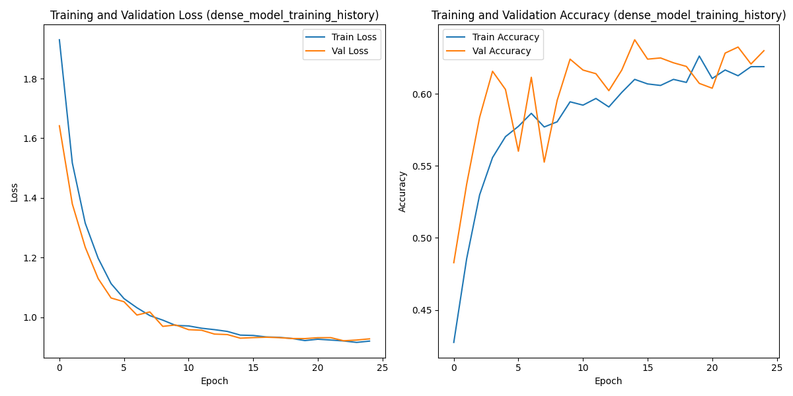
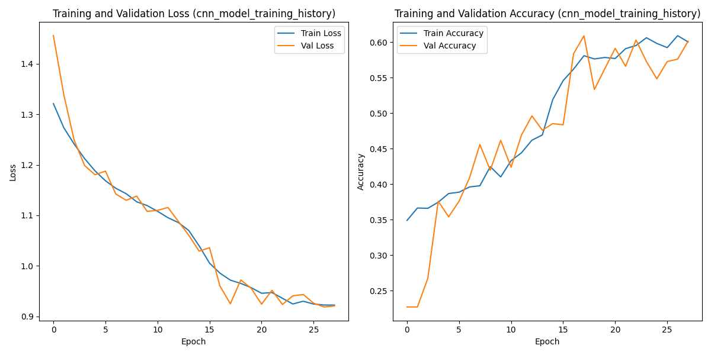

# Midterm Project: Premier League Football Prediction

## Overview

This project aims to predict the outcomes of Premier League football matches using machine learning models. It explores various features to determine their importance in predicting match results—whether it’s a home win, draw, or away win.

## Table of Contents

- [Overview](#overview)
- [Problem Description](#problem-description)
- [Data](#data)
  - [Home Wins (H)](#home-wins-h)
  - [Away Wins (A)](#away-wins-a)
  - [Draws (D)](#draws-d)
- [Key Observations](#key-observations)
- [Scripts](#scripts)
  - [data\_gathering](#data_gathering)
  - [data\_preparation](#data_preparation)
  - [eda](#eda)
  - [train\_model](#train_model)
    - [Notebook: 04\_train\_model.ipynb](#notebook-04_train_modelipynb)
  - [predict](#predict)
  - [back\_testing\_market](#back_testing_market)
- [Getting Started](#getting-started)
  - [Prerequisites](#prerequisites)
  - [Clone the Repository](#clone-the-repository)
  - [Installing Dependencies](#installing-dependencies)
    - [Navigate to Your Project Directory](#navigate-to-your-project-directory)
    - [Install the Project Dependencies](#install-the-project-dependencies)
    - [Activate the Virtual Environment](#activate-the-virtual-environment)
  - [Running Docker](#running-docker)
  - [Running on AWS Elastic Beanstalk](#running-on-aws-elastic-beanstalk)
    - [Run Locally Elastic Beanstalk](#run-locally-elastic-beanstalk)
    - [Run Elastic Beanstalk on AWS](#run-elastic-beanstalk-on-aws)
  - [Testing the Model](#testing-the-model)
    - [Insights from models versus the market](#insights-for-back_testing_market)
  - [Running the Streamlit App (Bonus)](#running-the-streamlit-app-bonus)
- [Contributing](#contributing)

---

## Problem Description

Predicting football match outcomes is a challenging yet captivating task that has long intrigued sports analysts and enthusiasts. This project focuses on the Premier League, aiming to forecast match results—home win, draw, or away win—by leveraging historical match data and team statistics.

In the [mlzoomcamp2024-midterm-project](https://github.com/RuiFSP/mlzoomcamp2024-midterm-project/tree/main), traditional machine learning algorithms like XGBoost were employed to build robust models, achieving strong performance and identifying key features that influence match outcomes. Building upon that foundation, the final project shifts toward exploring deep learning approaches, which can capture more complex patterns and interactions within the data.

By employing advanced deep learning architectures (e.g., neural networks, LSTMs, or CNNs), the project aims to:

Improve prediction accuracy.
Explore how deep learning can handle the inherent unpredictability and dynamic nature of football matches.
Gain insights into latent patterns that traditional methods may overlook.
Despite the ever-changing dynamics of sports and the competitive nature of prediction markets, this project aspires to push the boundaries of sports analytics by integrating cutting-edge techniques. The ultimate goal is not only to enhance predictive performance but also to provide valuable insights into the factors driving match outcomes.

---

## Data

The raw data for this project is sourced from [Football Data](https://www.football-data.co.uk/data.php). The focus is exclusively on the Premier League, covering seasons from 2005/2006 to 2024/2025. The raw data files can be found [here](https://github.com/RuiFSP/mlzoomcamp2024-midterm-project/tree/main/data/raw_data).


### Home Wins (H)
- **Dominant Trend**: Home wins consistently have the highest percentage among the three outcomes.
- **Long-Term Decline**: There is a slight decline in home win percentages from 2005 to around 2019.
- **Impact of 2020**: A significant drop occurs in 2020, likely due to external factors (e.g., the COVID-19 pandemic reducing home advantage).
- **Recovery**: Home win percentages show a recovery trend after 2020.

### Away Wins (A)
- **Stable Range**: Away wins generally hover in the 20–30% range, with minor fluctuations.
- **Recent Increase**: There is a slight increase in away wins in recent years, peaking around 2021 before stabilizing.

### Draws (D)
- **Lowest Percentage**: Draw percentages remain the lowest of the three outcomes, staying between 20–30%.
- **No Long-Term Trend**: There is no significant upward or downward trend, although short-term spikes and dips are visible.

## Key Observations
1. **2020 as a Pivotal Season**:
   - Home wins dropped significantly.
   - Away wins and draws increased noticeably during this season, potentially due to the neutralization of home advantage (e.g., matches without crowds).

2. **Home Advantage**: Home wins remain the dominant result over the years, indicating the significant influence of playing at home in football/soccer.

3. **Shift Toward Away Wins**: In the later years of the dataset, away wins have gained slight prominence.

---

## Scripts


### data_gathering

The `data_gathering.py` script performs the following key steps:

1. **Ensure Directories Exist**: Checks and creates necessary directories for storing data.
2. **Download Data**: Downloads CSV files for the specified seasons.
3. **Check Columns**: Verifies that the columns in the downloaded files match the expected schema.
4. **Concatenate Data**: Combines data from multiple seasons into a single dataset.
5. **Save Processed Data**: Saves the concatenated data to a CSV file for further processing.

For more details, see the [data_gathering.py](scripts/data_gathering.py) script.

### data_preparation

The `data_preparation.py` script performs the following key steps:

1. **Fix Columns, Teams, and Referees**: Rename columns, clean team names, and clean referee names.
2. **Handle Missing Values**: Drop rows with missing values and reset the index.
3. **Feature Engineering**: Create new features such as goal difference, total shots, shot accuracy, and time-based features.
4. **Rolling Averages**: Calculate rolling averages for various statistics over 3 and 5 game windows.
5. **Cumulative Points**: Compute cumulative points for home and away teams.
6. **Normalize Betting Odds**: Convert betting odds to implied probabilities.
7. **Save Processed Data**: Save the processed data for the current season (2024) and the final prepared dataset to CSV files.

For more details, see the [02_data_preparation.py](scripts/data_preparation.py) script.

### eda

The `eda.py` script is dedicated to Exploratory Data Analysis (EDA). It includes the following key steps:

1. **Data Checking**: Check data types, missing values, unique values, duplicates, and outliers.
2. **Saving Data**: Save the cleaned and processed data for modeling and backtesting.

> Note: In the **final project**, we focus on deep learning approaches, so we do not perform correlation analysis or VIF calculation as deep learning models can handle multicollinearity better. It is generally less critical to remove highly correlated features or to calculate VIF, as deep learning models can handle multicollinearity better than traditional machine learning models. We simplified our script by removing the parts related to finding highly correlated features and calculating VIF

For more details, see the [eda.py](scripts/eda.py) script.

### train_model

The `train_model.py` script covers the following key steps:

1. **Data Preprocessing**: Load and preprocess the data, including encoding categorical features and scaling numerical features.
2. **Data Splitting**: Split the data into training and test sets.
3. **Class Weights Calculation**: Compute class weights to handle imbalanced datasets.
4. **Model Building**: Build a Keras model with hyperparameter tuning using Keras Tuner.
5. **Hyperparameter Tuning**: Perform hyperparameter tuning to find the best model configuration.
6. **Model Evaluation**: Evaluate the best model on the test set.
7. **Model Saving**: Save the best model and preprocessing objects for future use.

For more details, see the [train_model.py](scripts/train_model.py) script.

### Extra Notes for Picking models

In the `04_train_model.ipynb` notebook, we trained various machine learning models on the dataset. Here are the key steps:

1. #### **Model Training Tryouts (Dense NN, CNN, LSTM, TCNs, LSTM with Attention)**:
   - Models:

     - ##### **Dense Neural Network**: A simple feedforward neural network used as a baseline model.

     <div style="display: flex; justify-content: space-between;">
       
       
     </div>

     - #### **Convolutional Neural Network (CNN)**: Used to capture spatial patterns in the data.

     <div style="display: flex; justify-content: space-between;">
       
       
     </div>

     - #### **Long Short-Term Memory (LSTM)**: Used for capturing temporal dependencies in the data.

     <div style="display: flex; justify-content: space-between;">
       
       
     </div>

     - #### **Temporal Convolutional Networks (TCNs)**: Combines the benefits of CNNs and RNNs for sequence modeling.

     <div style="display: flex; justify-content: space-between;">
       
       
     </div>

     - #### **LSTM with Attention Mechanism**: Enhances the LSTM model by focusing on important parts of the sequence.

     <div style="display: flex; justify-content: space-between;">
       
       
     </div>

   - Each model was trained with early stopping and learning rate scheduling.
   - Evaluated each model on the test set and printed the test accuracy.

2. **Hyperparameter Tuning**:
   - Used Keras Tuner to perform hyperparameter tuning on the Dense model.
   - Defined a function to build the model with hyperparameters.
   - Set up and ran the tuner.
   - Retrieved and evaluated the best model from the tuning process.
   - Saved the best model and printed its test accuracy.

3. **Comparison**:
   - Compared the test accuracy of the best model with the original Dense model.
  
For more details, see the [04_train_model.ipynb](notebooks/04_train_model.ipynb) notebook.

### predict

The `predict.py` script includes the following key steps:

1. **Loading the Model and Data**: Load the trained model and preprocessing objects.
2. **Setting Up Flask App**: Set up a Flask app to handle prediction requests.
3. **Prediction Endpoint**: Define an endpoint to receive match data and return predictions.
4. **Health Check Endpoint**: Define an endpoint to check the health status of the service.
5. **Input Validation**: Validate the input data for required fields and correct formats.
6. **Feature Engineering**: Generate features from the input data, including date-related features.
7. **Preprocessing**: Apply the same preprocessing steps used during model training.
8. **Prediction**: Use the trained model to predict match outcomes and probabilities.
9. **Response Formatting**: Format the prediction results into a JSON response.

For more details, see the [predict.py](scripts/predict.py) script.

### back_testing_market

The `back_testing_market.py` script includes the following key steps:

1. **Loading Data**: Load the processed data for back-testing.
2. **Loading Model and Transformers**: Load the trained model and preprocessing objects.
3. **Data Preprocessing**: Preprocess the data and split it into training and testing sets.
4. **Predicting Results**: Use the trained model to predict match outcomes and probabilities.
5. **Creating Team Names DataFrame**: Create a DataFrame to store team names, true results, predicted results, and probabilities.
6. **Calculating Brier Scores**: Calculate the Brier scores for the market and the model to evaluate prediction accuracy.

For more details, see the [back_testing_market.py](scripts/back_testing_market.py) script.

#### Insights for back_testing_market

In sports or betting, the Brier score evaluates how well a model predicts outcomes (e.g., home win, away win, or draw). Comparing a model's Brier score to a market's score (like bookmakers' predictions) helps determine which performs better

### What is the Brier Score?

The **Brier score** is a metric used to evaluate the accuracy of probabilistic predictions. It measures the **mean squared difference** between predicted probabilities and actual outcomes.

#### Formula:

---

**Brier Score = (1/N) * Σ (forecastᵢ - outcomeᵢ)²**

- **Forecast**: The predicted probability of an event occurring (e.g., 0.7 for "Team A wins").
- **Outcome**: The actual result, represented as 1 if the event occurs or 0 if it does not.

---

### Interpretation:
- **Range**: The Brier score ranges from **0 to 1**:
  - **0**: Perfect predictions (all probabilities match actual outcomes exactly).
  - **1**: The worst possible predictions.
- **Lower scores are better**, as they indicate more accurate predictions.

---

### Use in Sports or Forecasting:
In sports or betting, the Brier score evaluates how well a model predicts outcomes (e.g., home win, away win, or draw). Comparing a model's Brier score to a market's score (like bookmakers' predictions) helps determine which performs better.


- **key insights:**
  - Teams with positive differences (e.g., Brentford, Norwich, Bournemouth): The model tends to perform better than the market (lower Brier score means better predictions) for these teams when they play at home.
  - Teams with negative differences (e.g., West Brom, Man City): The market predictions outperform the model for these teams at home.
  - Neutral performance: Teams like Liverpool show minimal difference, meaning the model's and market's accuracy are almost equivalent for these cases.


- **Key insights:**
  - The peak of the distribution is centered around 0, indicating that, on average, the model and market have similar accuracy.
  - The spread shows a mix of cases where the model either outperforms or underperforms compared to the market:
    - Negative differences: Indicate the market is more accurate.
    - Positive differences: Indicate the model is more accurate.
  - Extreme values on either side (e.g., -0.3 or 0.4) occur less frequently, indicating most predictions are relatively close.


- **Key insights:**
  - Green areas (positive values): Indicate matchups where the model outperformed the market.
    - Example: Brentford at home against certain teams performs exceptionally well.
  - Red areas (negative values): Highlight matchups where the market predictions outperformed the model.
    -Example: Sheffield United or Luton at home against specific teams.
  - Neutral areas: Light yellow zones suggest similar performance between the model and the market for those matchups.


- **Overall Interpretation**
  - The model's performance varies by team and matchup. For some teams (e.g., Brentford, Norwich), the model is systematically better than the market, especially at home, while for others (e.g., Man City, West Brom), the market outperforms.
  - The distribution graph suggests general parity between model and market accuracy, with differences clustering around zero and a smaller proportion of extreme cases.
  - The heatmap offers granular insights, showing specific team matchups where one side (model or market) consistently performs better.

## Getting Started

### Prerequisites

- Python 3.8 or higher
- Docker
- Pipenv

### Clone the Repository

Use `git clone` to copy the repository to your local machine and navigate into the project directory.

```bash
  git clone git@github.com:RuiFSP/mlzoomcamp2024-final-project.git
  cd mlzoomcamp2024-final-project
```

### Installing Dependencies

#### Navigate to Your Project Directory

First, open a terminal and change to the directory where your `Pipfile` and `Pipfile.lock` are located.

#### Install the Project Dependencies

In the project directory, use `pipenv install` to create the virtual environment and install all dependencies specified in the `Pipfile.lock`.

```bash
  pipenv install
```

This command will:

- Create a virtual environment if one doesn’t already exist.
- Install the dependencies exactly as specified in the `Pipfile.lock`.

#### Activate the Virtual Environment

To activate the virtual environment, use:

```bash
  pipenv shell
```

Now you're in an isolated environment where the dependencies specified in the `Pipfile.lock` are installed.

### Running Docker

Build the Docker image:

  > my setup: 
  > `<docker_image_name>` is project-ml

```bash
    docker build -t project-ml .
```

Run the Docker container:

```bash
    docker run -it --rm -p 9696:9696 project-ml
```


> **Note:**  
> If you get an error with `[ 5/11] RUN 'pipenv install --system --deploy'`, try turning off your VPN.

### Running on AWS Elastic Beanstalk

To run Elastic Beanstalk, follow these steps:

-  **Install the AWS Elastic Beanstalk CLI**:

    > **Note:** don't forget you need to setup your access to AWS beforehand

    Ensure you have the AWS CLI and Elastic Beanstalk CLI installed. You can install the Elastic Beanstalk CLI using pip:

    ```bash
    pip install awsebcli
    ```

#### Run Locally Elastic Beanstalk

-  **Initialize Elastic Beanstalk**:
    Navigate to your project directory and initialize Elastic Beanstalk:

    > my setup:
    - `<project_name>` is project-ml

    ```bash
    eb init -p "Docker running on 64bit Amazon Linux 2" project-ml
    ```

    > Note: To run it locally i had to use Amazon Linux

    ```bash
    eb local run --port 9696
    ```

#### Run Elastic Beanstalk on AWS

-  **Create an Environment and Deploy**:
    Create a new environment and deploy your application:

    ```bash
    eb create project-ml --platform "Docker running on 64bit Amazon Linux 2"
    ```

    

- **Terminate the Environment**:
    When you are done, you can terminate the environment to stop incurring charges:

    ```bash
    eb terminate project-ml
    ```

### Testing the Model

Open a new terminal and run the test script:

```bash
    python tests/test_predict.py   # to test locally 
    python tests/test_predict_aws.py # to test aws 
```


To use the prediction service, send a POST request to the /predict endpoint with the following JSON payload locally or configure the test script accordingly:

```bash
curl -X POST http://127.0.0.1:9696/predict \
     -H "Content-Type: application/json" \
     -d '{
           "home_team": "arsenal",
           "away_team": "liverpool",
           "date": "2024-12-16"
         }'
```


### Running the Streamlit App (Bonus)

For fun you want to run a Streamlit app locally, follow these steps:

1. Ensure you have all dependencies installed and the virtual environment activated as described in the [Installing Dependencies](#installing-dependencies) section.

2. Navigate to the project directory where `app.py` is located.

3. Run the Streamlit app using the following command:

```bash
    streamlit run app.py
```


